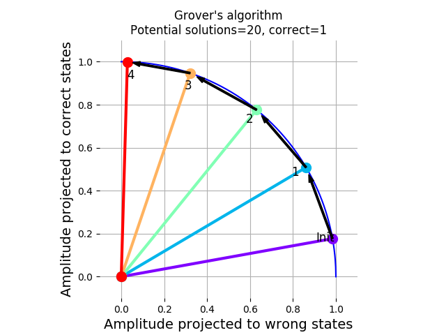
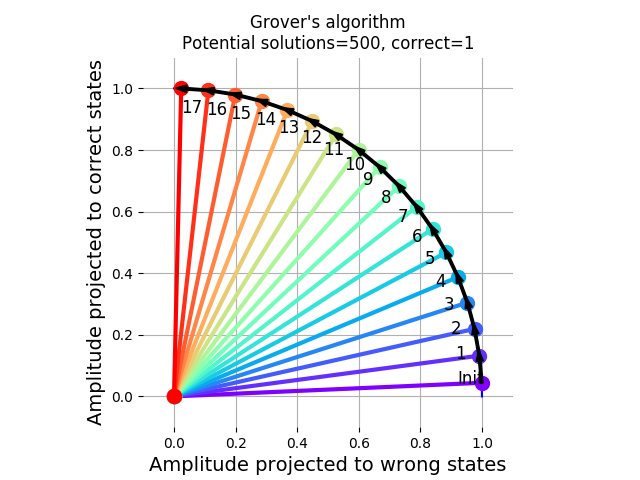
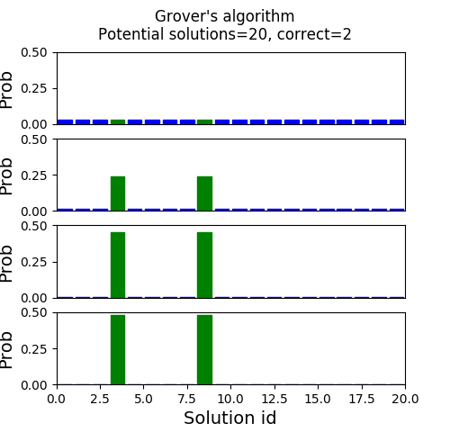

# A classical (non-quantum) implementation of the (quantum) Grover's algorithm

This is a classical (non-quantum) implementation of the (quantum) Grover's algorithm. The Grover's algorithm (https://en.wikipedia.org/wiki/Grover%27s_algorithm) is an algorithm that, with high probability, identifies a solution to a black box function. Thanks go to https://github.com/yquek for explainig the algorithm to me.

## Introduction
For a black box function `f(x)` with `N` potential solutions `[x1,x2,...,xN]` (among which `k` are correct), the Grover's algorithm can with high probability identify one of the correct solutions in order `sqrt(N)` steps. This is a significant speedup compared to the order `N` steps required by the classical approach, which generally involves checking all potential solutions.

## Classical representation of the quantum states and operators
This implementation is classical -- it runs on a classical computer. It therefore has to (expensively) simulate the quantum states and operators that would normally be implemented automatically by the virtue of nature being quantum. For the `N` potential solutions, we can use `N_q = ceil(log_2(N))` qubits, which are specified by `2^(N_q)` complex numbers (minus the normalization).

The `N_qubit` quantum state is represented as a *vector* of `2^N_qubit` complex numbers whose magnitudes sum to 1 (probability normalization) (https://en.wikipedia.org/wiki/Quantum_state).

Operations on the quantum state are represented as unitary `2^N_qubit x 2^N_qubit` matrices (https://en.wikipedia.org/wiki/Operator_(physics)#Operators_in_quantum_mechanics). To evolve the quantum state, you can matrix-multiply its vector with the corresponding matrix.

In the final step, the probability that a particular answer comes out after measuring the resulting quantum state is the square of the norm of the corresponding complex number in the vector representation of the quantum state.

## The program
The number of pontential solutions is specified by `N_potential_solutions` and the number of correct ones is `N_correct_solutions`. The expected number of steps to run the algorithm for is calculated in `steps_to_stop`. 

The program finds a solution to an example problem and generates 2 plots: a) the gradual rotation of the quantum state towards the subspace of correct solutions, and b) the gradual concentration of amplitude on the correct solutions.   

## Examples of state rotation towards correct solutions

## Examples of amplitude concentration on the correct solution

